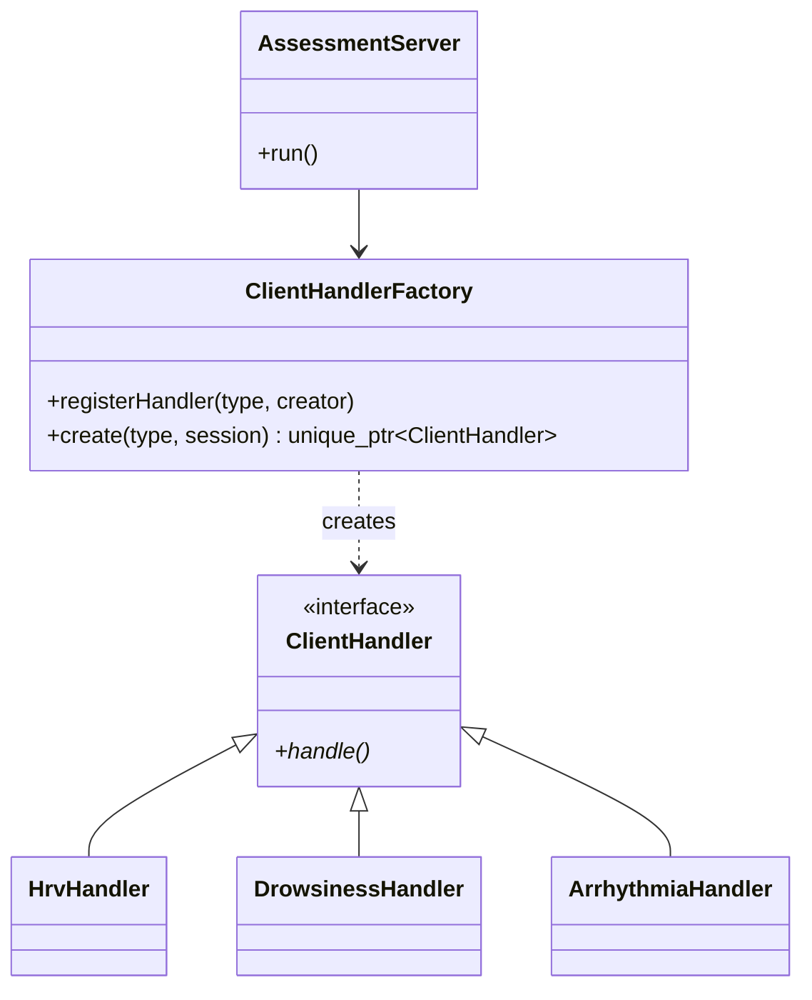
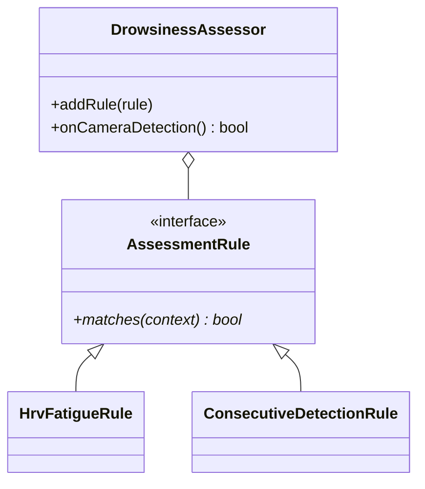

# HAMS Assessment Server — Modern C++ Refactoring

기존 POSIX C 기반 HAMS 건강 상태 판정 서버의 동작을 Modern C++20으로
재설계한 프로젝트입니다. 단순 문법 변환이 아니라 객체의 책임과 수명을
명확히 분리하고, 새로운 클라이언트·판정 규칙·알림 채널을 기존 코드 수정
없이 추가할 수 있는 구조를 목표로 합니다.

## 주요 설계



`AssessmentServer`는 구체적인 클라이언트 처리 클래스를 알지 못합니다.
초기 JSON의 `id`를 읽은 뒤 `ClientHandlerFactory`에 생성을 요청하고,
반환된 `ClientHandler`의 가상 함수 `handle()`만 호출합니다.



졸음 판정 규칙은 Strategy와 Composite 구조로 구성됩니다. 기본 설정은
다음 중 하나라도 참이면 졸음으로 판단합니다.

- 최근 HRV 평균이 `SDNN < 30`, `RMSSD < 20`, `PNN50 < 0.25` 중 하나에 해당
- 카메라 졸음 감지가 3회 연속 발생

## 적용한 C++ 설계 요소

- `ClientHandler`와 `AssessmentRule`의 런타임 다형성
- Registry 기반 Factory로 타입 분기 격리
- `std::unique_ptr`를 통한 구현 객체 소유권 표현
- 소켓과 파일 디스크립터의 RAII
- `BlockingQueue<T>` 템플릿과 `std::mutex`/`std::condition_variable`
- 전역 공유 상태를 `PpgRepository`, `DrowsinessAssessor` 객체로 캡슐화
- 의존성 주입이 가능한 `AlertPublisher`, `MessageParser` 인터페이스
- TCP 분할·병합을 고려한 JSON 객체/개행 메시지 프레이밍
- 입력 필드와 포트 범위 검증

## 디렉터리

```text
include/hams/
├── alert/          알림 출력 포트
├── assessment/     판정 규칙과 서비스
├── concurrency/    타입 안전 BlockingQueue
├── domain/         값 객체와 enum
├── handlers/       클라이언트별 다형적 Handler
├── net/            RAII 소켓과 TCP 세션
├── protocol/       메시지 파서
├── repository/     최근 PPG 데이터 저장소
└── server/         연결 수락 및 Handler 실행
```

## 빌드

서버의 소켓과 named pipe 구현은 Raspberry Pi/Linux를 대상으로 합니다.

```bash
cmake -S . -B build -DCMAKE_BUILD_TYPE=Release
cmake --build build
ctest --test-dir build --output-on-failure
./build/hams_assessment_server 8080
```

현재 GPS 프로세스가 읽는 FIFO에 맞춰 알림 경로를
`/tmp/symptom_pipe`로 통일했습니다.

## TCP 메시지

초기 식별 메시지:

```json
{"id":"hrv"}
```

HRV 데이터:

```json
{
  "signal": 510,
  "bpm": 72,
  "ibi": 833,
  "sdnn": 42.5,
  "rmssd": 31.2,
  "pnn50": 0.33,
  "timestamp": 1720000000
}
```

메시지는 개행으로 구분하는 NDJSON을 권장합니다. 이전 클라이언트와의
호환을 위해 완결된 최상위 JSON 객체도 개행 없이 인식합니다.

## 기존 C 구현에서 해결한 문제

- HRV 연결 종료 시 전역 큐가 파괴되던 수명 오류 제거
- 스레드 실행 상태 플래그와 분리된 자원 수명 문제 제거
- 길이 제한 없는 `strcpy` 제거
- `recv()` 한 번을 JSON 하나로 가정하던 TCP 경계 문제 개선
- 알 수 없는 ID가 부정맥으로 처리되던 기본 분기 제거
- Assessment와 GPS 프로세스의 FIFO 경로 불일치 수정
- 수동 `malloc/free`, 소켓 `close` 경로를 RAII로 대체
